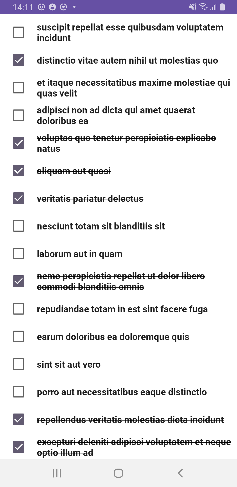

## Jetpack Compose: To-Do List App

<a href='https://drive.google.com/file/d/1dEGZ4Fz1AUXxGm4S42RRa5WrZHwRvIlX/view?usp=sharing'>Download the APK</a>

* UI completely in Jetpack Compose
* Uses Kotlin Coroutines
* Uses Kotlin Flow
* Uses many of the Architecture Components, including: Room, DataStore, Navigation, ViewModel
* Uses Hilt for dependency injection

## Screen

  
